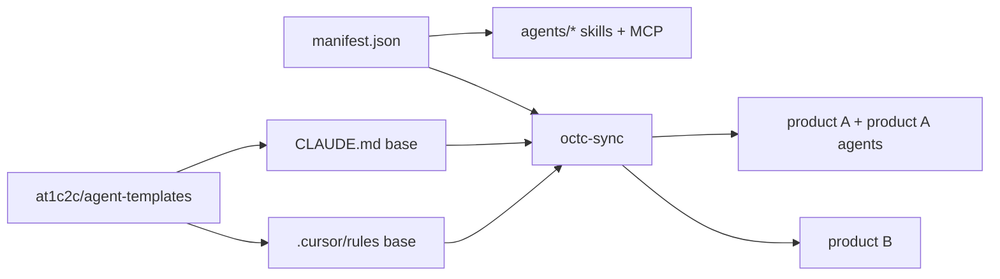

# Agent runtime sync

Cómo se propagan capacidades agénticas desde un ACP hasta los runtimes de ejecución (Cursor, Claude Code/Desktop, OpenClaw, Codex, Paperclip, CI).

## Modelo

- **Fuente única por capacidad:** una skill o un MCP **vive en un solo ACP**. Si dos repos la necesitan, se consume desde el ACP, no se duplica.
- **Plantilla normativa única:** `CLAUDE.md`, `.cursor/rules/*.mdc` y `AGENTS.md` se generan desde `@1c2c/agent-templates`. Los repos extienden mediante `extends:` o secciones marcadas, nunca redefinen la base.
- **Sincronización:** un script `octc-sync` (planeado) consume el manifest del ACP y produce los archivos consumibles por cada runtime.

## Ejemplos de flujo

## Reglas

1. Versión del template fijada por commit en cada repo consumidor (`agent_templates_pin` en PORTFOLIO).
2. Cambios en `@1c2c/agent-templates` siguen política de [docs/packages/POLICY.md](../packages/POLICY.md).
3. Allowlist de herramientas/MCP del ACP debe ser respetada por todos los runtimes; si un runtime no la respeta, ese runtime queda **fuera** del tier L2+.

## Pendientes

- Implementar `octc-sync` como `@1c2c/cli` (Q3 2026).
- Documentar adapters específicos por runtime en `docs/agents/ORCHESTRATION.md`.
