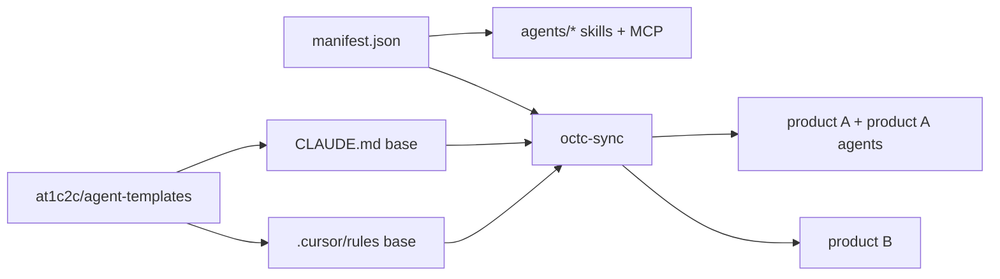

# Agent runtime sync

How agent capabilities propagate from an ACP to execution runtimes (Cursor, Claude Code/Desktop, OpenClaw, Codex, Paperclip, CI).

## Model

- **Single source per capability:** a skill or MCP **lives in one ACP** only. If two repos need it, they consume from the ACP — no duplication.
- **Single normative template:** `CLAUDE.md`, `.cursor/rules/*.mdc`, and `AGENTS.md` are generated from `@1c2c/agent-templates`. Repos extend via `extends:` or marked sections; they never redefine the base.
- **Synchronization:** a planned `octc-sync` script will consume the ACP manifest and emit files consumable by each runtime.

## Example flow

## Rules

1. Template version is pinned by commit in each consumer repo (`agent_templates_pin` in PORTFOLIO).
2. Changes to `@1c2c/agent-templates` follow [docs/packages/POLICY.md](../packages/POLICY.md).
3. ACP tool/MCP allowlists must be respected by all runtimes; if a runtime cannot enforce them, that runtime is **out** of tier L2+.

## Open items

- Extend `octc sync` with governance templates and ACP→runtime pipeline (see adapters in `docs/agents/ORCHESTRATION.md`).
- **`@1c2c/cli`:** published as MVP — `octc sync agents` and `octc agents …` delegate to `octc-agents`.
